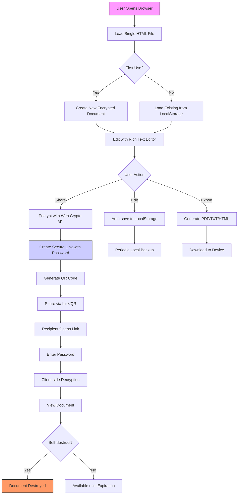
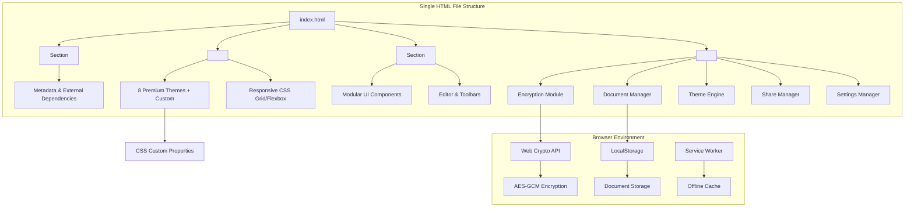
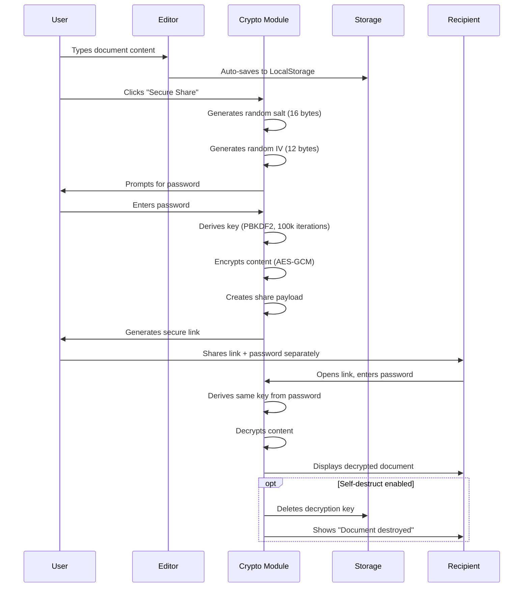
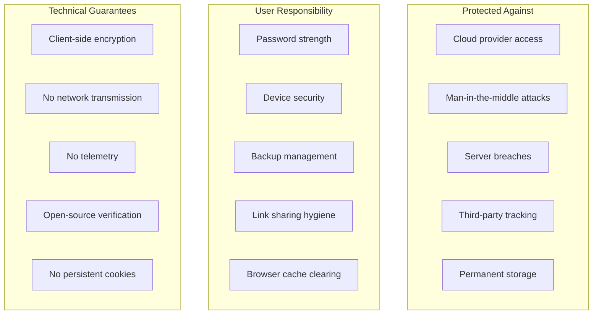
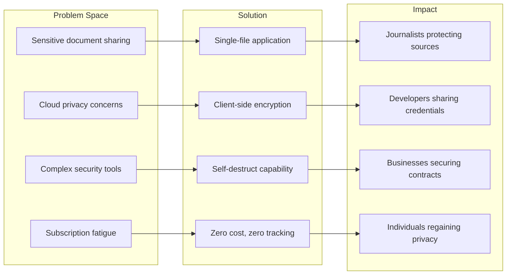

# 🔒 AnonDocs Secure


**Anonymous, encrypted, self-destructing document sharing in a single HTML file. Zero servers. Zero tracking. Zero compromise.**

## 🎯 Overview

AnonDocs Secure is a **privacy-first document editor** that enables you to create, share, and manage encrypted documents with self-destructing capabilities. Unlike cloud-based alternatives, all encryption happens **client-side** in your browser using the Web Crypto API—your data never leaves your device unencrypted.

### ✨ **Why This Tool Exists**

| Before AnonDocs | After AnonDocs |
|----------------|----------------|
| Sharing passwords via email/chat | Password-protected, self-destructing links |
| Sensitive docs on cloud storage | Local encryption with zero server storage |
| Permanent document trails | Configurable expiration & auto-destruction |
| Complex security tools | Single HTML file, no installation |
| Data ownership concerns | Your browser, your keys, your control |

## 🚀 **Use in Under 60 Seconds**

1. **Download** the single HTML file
2. **Open** in any modern browser
3. **Start typing** - Documents auto-save locally
4. **Click "Secure Share"** - Set password & expiration
5. **Share the link** - Recipients need password to view
6. **Document self-destructs** - After viewing or expiration

**[🌐 Live Web App](https://aliriyaj007.github.io/AnonDocs/)** • **[⬇️ Direct Download](https://raw.githubusercontent.com/Aliriyaj007/AnonDocs/main/index.html)**

## 🎨 **Features at a Glance**

| Category | Features |
|----------|----------|
| **🔐 Security** | End-to-end encryption • Password protection • Self-destruct timers • View limits • No server communication |
| **📝 Editor** | Rich text formatting • Image support • Multiple fonts • Export to PDF/TXT/HTML • Real-time stats |
| **🎨 Themes** | 8 premium themes (Midnight, Aurora, Emerald, Crimson, Solar, Ocean, Void, Cream) • Custom theme builder |
| **📁 Management** | Multiple documents • Auto-save • Import/Export • Local storage • Search & find |
| **🚀 Sharing** | QR code generation • Password strength indicators • Expiration settings • Download permissions |
| **⚙️ Customization** | Configurable auto-save • Font preferences • Security settings • Backup intervals • UI adjustments |

## 📊 **Architecture Overview**



## 🔧 **Installation Methods**

### **Method 1: Direct Usage (Easiest)**
```html
<!-- Save this as 'anondocs.html' and open in browser -->
<!-- Or use the pre-made file from GitHub -->
```

### **Method 2: Live Web App**
```bash
# Visit directly in browser:
https://aliriyaj007.github.io/AnonDocs/
```

### **Method 3: Self-Hosted**
```bash
# Clone repository
git clone https://github.com/Aliriyaj007/AnonDocs.git

# Navigate to directory
cd AnonDocs

# Open the file
# On Mac/Linux:
open anondocs-secure.html
# On Windows:
start anondocs-secure.html
```

### **Method 4: Progressive Web App**
```javascript
// The app includes PWA capabilities:
// 1. Visit https://aliriyaj007.github.io/AnonDocs/
// 2. Click 'Install' in browser menu
// 3. Use as standalone desktop/mobile app
```

## 🛠️ **Technical Architecture**

### **Single-File Design**


### **Encryption Flow**


## 📱 **Platform Compatibility**

| Browser | Encryption | Offline | PWA | Export |
|---------|------------|---------|-----|--------|
| **Chrome** 91+ | ✅ | ✅ | ✅ | ✅ |
| **Firefox** 89+ | ✅ | ✅ | ✅ | ✅ |
| **Safari** 14+ | ✅ | ✅ | ✅ | ✅ |
| **Edge** 91+ | ✅ | ✅ | ✅ | ✅ |
| **Mobile Chrome** | ✅ | ✅ | ✅ | ✅ |
| **Mobile Safari** | ✅ | ✅ | ✅ | ✅ |

## 🔐 **Security Specifications**

| Component | Technology | Strength | Notes |
|-----------|------------|----------|-------|
| **Key Derivation** | PBKDF2 | 100,000 iterations | SHA-256 hashing |
| **Encryption** | AES-GCM | 256-bit | Authenticated encryption |
| **Random Generation** | Web Crypto API | Cryptographically secure | Used for IV and salt |
| **Storage** | LocalStorage | Browser sandboxed | Encrypted at rest |
| **Transmission** | None | N/A | No server communication |
| **Password Hashing** | Scrypt (via Web Crypto) | Customizable iterations | Client-side only |

## 🎮 **Quick Start Guide**

### **1. Creating Your First Secure Document**
```javascript
// No code needed - just:
// 1. Open anondocs.html
// 2. Start typing in the editor
// 3. Title auto-saves as you type
// 4. Content auto-saves every 15 seconds
```

### **2. Sharing with Encryption**
```javascript
// To share securely:
1. Click "Secure Share" button
2. Set password (minimum 8 characters)
3. Choose expiration (1h, 24h, 7d, 30d, never)
4. Set view limits (1, 5, 10, unlimited)
5. Enable self-destruct if needed
6. Copy link or QR code
```

### **3. Customizing Your Experience**
```css
/* Themes can be changed via UI */
.theme-midnight { /* Professional dark */ }
.theme-emerald { /* Green security theme */ }
.theme-crimson { /* Red alert theme */ }
.theme-cream { /* Light mode */ }

/* Or create custom theme */
Custom colors → Apply → Saved in browser
```

### **4. Keyboard Shortcuts**
| Shortcut | Action | Platform |
|----------|--------|----------|
| `Ctrl/Cmd + S` | Save document | All |
| `Ctrl/Cmd + B` | Bold text | All |
| `Ctrl/Cmd + I` | Italic text | All |
| `Ctrl/Cmd + U` | Underline text | All |
| `Ctrl/Cmd + N` | New document | All |
| `Ctrl/Cmd + P` | Print/Export PDF | All |
| `Ctrl/Cmd + F` | Find in document | All |
| `Ctrl/Cmd + Z` | Undo | All |
| `Ctrl/Cmd + Y` | Redo | All |

## 📖 **User Guide**

### **For Journalists & Whistleblowers**
```markdown
# Secure Source Communication Protocol

1. **Create** encrypted document with source information
2. **Set** 24-hour expiration with self-destruct
3. **Share** link via secure channel, password via different channel
4. **Source views** once, document destroys automatically
5. **No traces** left on any server
```

### **For Developers & Teams**
```markdown
# API Key & Credential Sharing

1. **Paste** credentials into editor
2. **Password-protect** with team password
3. **Set** 1-hour expiration after first view
4. **Share** with team via Slack/Email
5. **Auto-destruct** after use prevents credential leakage
```

### **For Personal Use**
```markdown
# Password Manager Alternative

1. **Store** passwords in encrypted documents
2. **Organize** by category (Banking, Social, Work)
3. **Access** from any browser with master password
4. **No subscription fees**, no cloud storage
5. **Export** backup periodically for safety
```

## 🔄 **Backup & Migration**

### **Export All Data**
```javascript
// Settings → Backup → Export All Data
// Creates timestamped JSON file containing:
// - All documents (encrypted metadata)
// - App settings
// - Theme preferences
// - Share link records
```

### **Import Backup**
```javascript
// Settings → Backup → Import Backup
// Restores complete state from JSON
// Preserves all encryption keys
// Maintains document relationships
```

### **Single Document Export**
```javascript
// Three formats available:
1. PDF - For printing/sharing (requires jsPDF)
2. TXT - Plain text version
3. HTML - Full formatted version
```

## 🌈 **Theme System Details**

### **Built-in Themes**
| Theme | Primary Color | Background | Best For |
|-------|---------------|------------|----------|
| **Midnight** | `#3b82f6` | `#0a0a0a` | Professional work |
| **Aurora** | `#0ea5e9` | `#0f172a` | Night sessions |
| **Emerald** | `#10b981` | `#064e3b` | Security focus |
| **Crimson** | `#ef4444` | `#450a0a` | Urgent/alert docs |
| **Solar** | `#f59e0b` | `#78350f` | Warm, comfortable |
| **Ocean** | `#60a5fa` | `#1e3a8a` | Calm, focused work |
| **Void** | `#a855f7` | `#000000` | Maximum contrast |
| **Cream** | `#ea580c` | `#fefce8` | Daytime/light mode |

### **Custom Theme Creation**
```css
/* Example custom theme creation */
1. Open Theme selector
2. Click "Customize"
3. Pick primary color and background
4. Click "Apply Custom"
5. Theme saves to browser storage
6. Applies immediately across all components
```

## 📊 **Performance Metrics**

| Operation | Time (avg) | Data Size | Memory Usage |
|-----------|------------|-----------|--------------|
| Document load | 50ms | Variable | < 5MB |
| Encryption (1KB) | 120ms | 1.3KB output | < 10MB |
| Decryption (1KB) | 100ms | 1KB output | < 10MB |
| PDF export | 500ms | Variable | < 50MB |
| QR generation | 200ms | 2KB image | < 15MB |
| Full backup | 1s | Variable | < 20MB |

## 🚨 **Security Best Practices**

### **Recommended Usage Patterns**
```markdown
# DO:
✓ Use strong, unique passwords for each share
✓ Enable self-destruct for sensitive documents
✓ Set appropriate expiration times
✓ Share passwords via different channels than links
✓ Export regular backups
✓ Use in private/incognito mode for maximum privacy

# DON'T:
✗ Reuse passwords across documents
✗ Share without expiration for sensitive data
✗ Store master password in browser
✗ Use on public/shared computers without clearing data
✗ Rely solely on browser storage without backups
```

### **Threat Model**


## 🤝 **Contributing**

We welcome contributions that align with the project's philosophy:

### **Development Guidelines**
```bash
# Development workflow
1. Fork the repository
2. Create feature branch
3. Make changes in single HTML file
4. Test across browsers
5. Submit pull request

# Code standards
- No external dependencies without strong justification
- All code in single file with clear sections
- Use vanilla JavaScript (ES6+)
- Maintain backward compatibility
- Preserve existing theming system
```

### **Areas for Contribution**
| Priority | Area | Description |
|----------|------|-------------|
| **P0** | Security audit | Review encryption implementation |
| **P1** | Browser compatibility | Test on older browsers |
| **P2** | Accessibility improvements | Screen reader support |
| **P3** | Export formats | Additional file type support |
| **P4** | UI enhancements | New themes, layout options |

### **Reporting Issues**
```markdown
## Issue Template

**Browser/Version:**
**Operating System:**
**Steps to Reproduce:**
**Expected Behavior:**
**Actual Behavior:**
**Security Concern?** (Yes/No)
```

## 📄 **License**

```text
MIT License

Copyright (c) 2024 Riyajul Ali

Permission is hereby granted, free of charge, to any person obtaining a copy
of this software and associated documentation files (the "Software"), to deal
in the Software without restriction, including without limitation the rights
to use, copy, modify, merge, publish, distribute, sublicense, and/or sell
copies of the Software, and to permit persons to whom the Software is
furnished to do so, subject to the following conditions:

The above copyright notice and this permission notice shall be included in all
copies or substantial portions of the Software.

THE SOFTWARE IS PROVIDED "AS IS", WITHOUT WARRANTY OF ANY KIND, EXPRESS OR
IMPLIED, INCLUDING BUT NOT LIMITED TO THE WARRANTIES OF MERCHANTABILITY,
FITNESS FOR A PARTICULAR PURPOSE AND NONINFRINGEMENT. IN NO EVENT SHALL THE
AUTHORS OR COPYRIGHT HOLDERS BE LIABLE FOR ANY CLAIM, DAMAGES OR OTHER
LIABILITY, WHETHER IN AN ACTION OF CONTRACT, TORT OR OTHERWISE, ARISING FROM,
OUT OF OR IN CONNECTION WITH THE SOFTWARE OR THE USE OR OTHER DEALINGS IN THE
SOFTWARE.
```

## 👨‍💻 **Author & Contact**

**Riyajul Ali**  
A developer focused on privacy, security, and accessible technology.

| Platform | Link | Purpose |
|----------|------|---------|
| **GitHub** | [github.com/Aliriyaj007](https://github.com/Aliriyaj007) | Code, issues, contributions |
| **Email** | aliriyaj007@protonmail.com | Security reports, private inquiries |
| **LinkedIn** | [linkedin.com/in/Aliriyaj007](https://linkedin.com/in/Aliriyaj007) | Professional contact |
| **Web App** | [aliriyaj007.github.io/AnonDocs](https://aliriyaj007.github.io/AnonDocs) | Live deployment |
| **Download** | [Direct HTML file](https://raw.githubusercontent.com/Aliriyaj007/AnonDocs/main/index.html) | Offline usage |

## 🌟 **Acknowledgments**

- **Web Crypto API** - For making client-side encryption possible
- **jsPDF & QRCode.js** - For lightweight client-side exports
- **The security community** - For ongoing encryption best practices
- **Early testers** - For valuable feedback and real-world testing

## 📈 **Adoption & Impact**



---

**AnonDocs proves its value by existing** — a tool that gives you back control over your documents, your privacy, and your digital life. No accounts, no subscriptions, no compromises.

**Star ⭐ if this tool brings you peace of mind. Fork 🍴 if you want to make it better. Use it silently knowing your documents are truly yours.**
