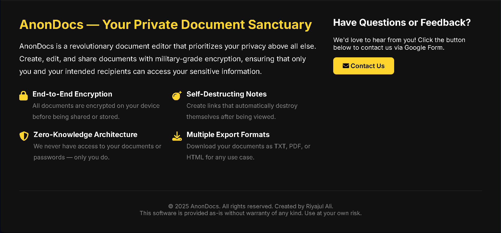

# AnonDocs: Secure Private Document Sharing

 <!-- *Optional: Add a screenshot later* -->

**AnonDocs** is a cutting-edge, client-side web application for creating, editing, and sharing private documents with end-to-end encryption. All data is stored locally in your browser, and sensitive operations like encryption happen entirely on your device, ensuring maximum privacy and security.

## ✨ Key Features

*   **Zero-Knowledge Architecture**: Your documents and passwords never leave your browser. We can't see your data.
*   **Self-Destructing Notes**: Share encrypted links that automatically expire or destroy themselves after being read once.
*   **Rich Text Editing**: Format your documents with bold, italic, lists, colors, fonts, and more.
*   **Modern Gold & Black UI**: A luxurious, distraction-free interface designed for focus and elegance.
*   **First-Time User Tutorial**: A guided walkthrough to help you get started immediately.
*   **Installable as a PWA**: Add AnonDocs to your home screen for an app-like experience.
*   **Offline Support**: Works even without an internet connection (after initial load).

## 🎨 Design Philosophy

AnonDocs v2.0, codenamed "**Gold Standard**," features a complete visual overhaul:

*   **Color Palette**: Strictly **Black, White, and Gold**. All blue hues have been removed for a more sophisticated, luxurious feel.
*   **Button Effects**: Primary buttons feature a stunning **gold glow effect**. Secondary buttons use a sleek **glassmorphism** design.
*   **Intuitive Navigation**: The confusing "hamburger" menu has been replaced with a clear, labeled "**Docs**" toggle button that reliably opens and closes.
*   **Enhanced Discoverability**: Every button and feature now has a descriptive **tooltip** that appears on hover.
*   **Onboarding**: A **first-time user tutorial** guides new users through the core workflow: create, save, and share.

## 🚀 Getting Started

AnonDocs is a static web application. You can run it anywhere!

### Option 1: Live Demo (Recommended)

Visit the live demo: **[https://anondocs.example.com](https://anondocs.example.com)** (Replace with your actual URL)

### Option 2: Run Locally

1.  **Clone this repository** (or simply download the 4 files: `index.html`, `style.css`, `app.js`, `sw.js`).
2.  **Open `index.html`** in any modern web browser (Chrome, Firefox, Safari, Edge).
3.  **That's it!** You're ready to create and share secure documents.

### Option 3: Deploy to Your Server

1.  Upload all files to your web server's root directory.
2.  Ensure your server is configured to serve `.html`, `.css`, and `.js` files correctly.
3.  Navigate to your domain in a browser.

## 📱 Install as a Web App (PWA)

AnonDocs is a Progressive Web App (PWA). You can install it on your device for a native app experience.

*   **On Desktop (Chrome/Edge)**: Click the "Install" icon (a small monitor with a down arrow) in the browser's address bar.
*   **On Mobile (Android/iOS)**: Tap the "Share" button in your browser, then select "Add to Home Screen."

## 🔐 Security & Privacy

*   **Encryption**: Uses the browser's built-in **Web Crypto API** with **AES-GCM** and **PBKDF2** for strong, client-side encryption.
*   **Storage**: All your documents are saved in your browser's `localStorage`. They are never transmitted to any server.
*   **Sharing**: Secure notes are shared via URL fragments (`#note=...`). This data is never sent to the server.
*   **No Accounts**: There is no signup or login. Your data belongs entirely to you.

## 🛠️ Technology Stack

*   **Frontend**: Vanilla HTML5, CSS3, JavaScript (ES6+)
*   **Icons**: Font Awesome (v6.4.0)
*   **Encryption**: Web Crypto API (Native Browser)
*   **Storage**: `localStorage`
*   **PWA**: Web App Manifest, Service Worker

## 📜 License

This project is licensed under the MIT License. See the `LICENSE` file for details.

---

**Enjoy your private, secure, and beautiful document sharing experience with AnonDocs.**